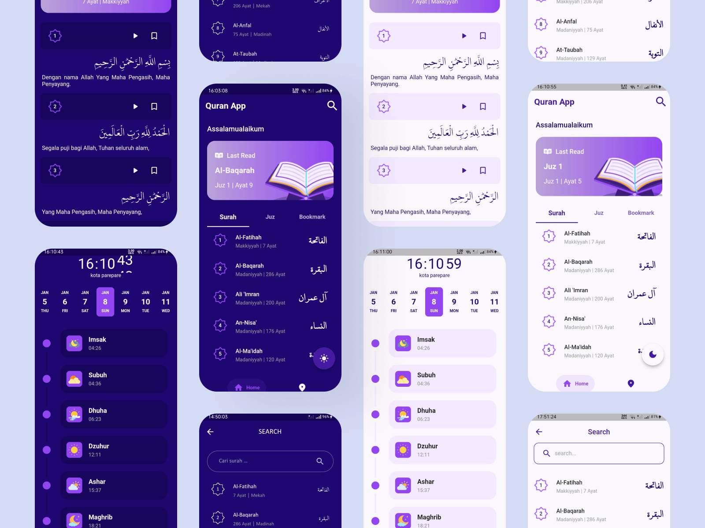

# QuranApp

QuranApp adalah aplikasi al-quran digital, yang dirancang menggunakan dart (Flutter) dengan menggunakan state management GetX. Terdapat beberapa fitur seperti.
- Offline kecuali juz dan jadwal sholat
- Bookmark
- Last read
- Play audio ayat
- Search by surah
- Jadwal sholat sesuai kota

### API
- https://api.quran.gading.dev/
- https://documenter.getpostman.com/view/841292/Tz5p7yHS

### Download QuranApp

https://drive.google.com/file/d/1LrQuhd8MWzQZHg9jr5Cp8jPpRQd_3Ckz/view?usp=sharing

Figma By Tanvir Ahassan
 ```go
   https://www.figma.com/community/file/966921639679380402
```

## Preview


## Installation Flutter


1. Clone the repo

   ```bash
   git clone https://github.com/jarrfajar/Quran
   ```
2. Install packages

   ```dart
   flutter pub get
   ```